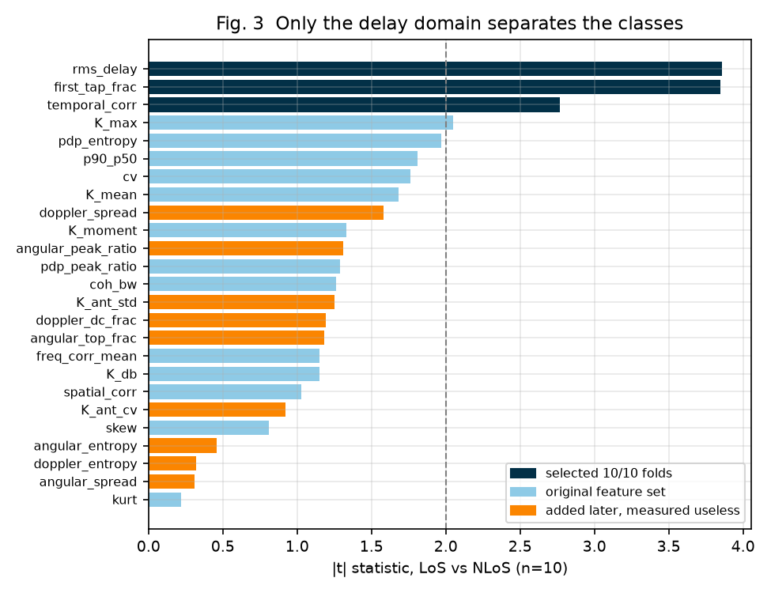
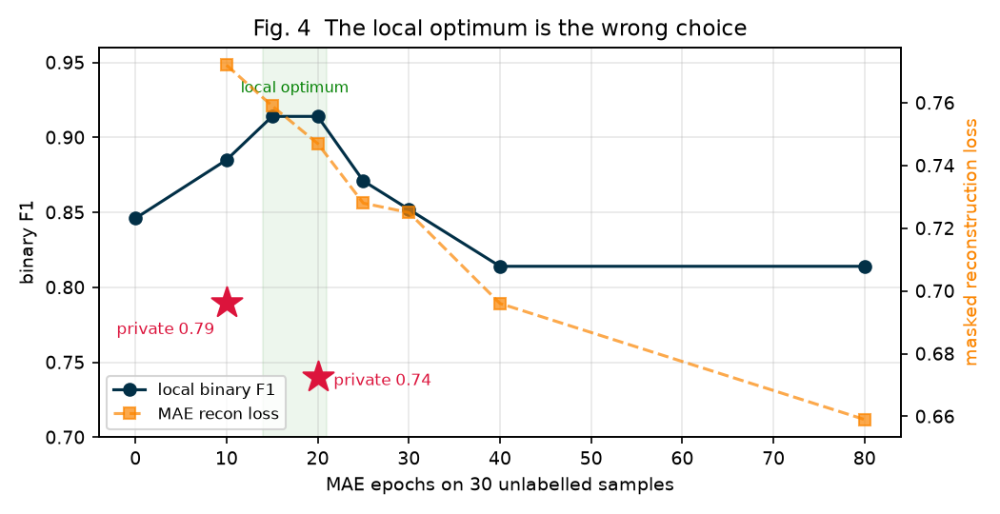
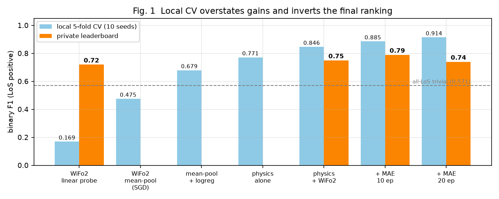
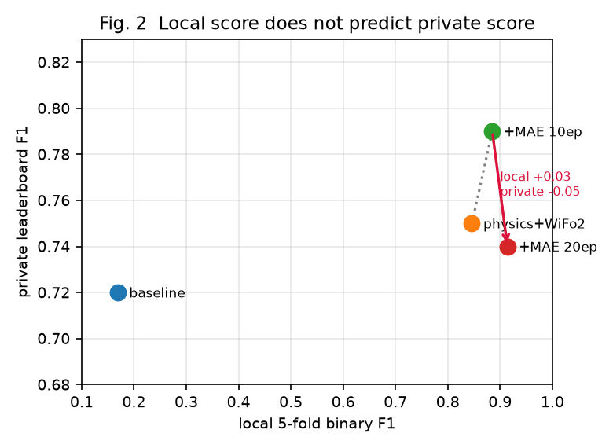
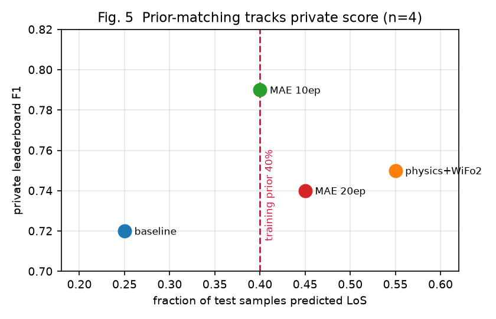
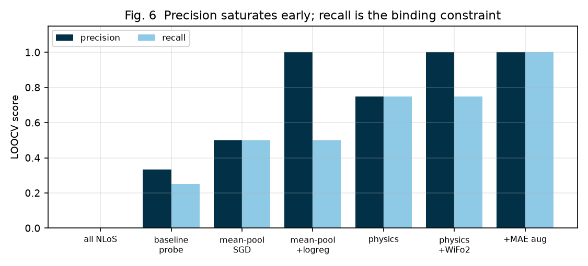

# Few-Shot LoS/NLoS Classification from CSI: What Transferred and What Did Not

**SoM2026 Challenge, Task 1 — methodology and results**

Working notes written in paper form. Repository: `SoM2026`, branch `task1`.
All numbers reproducible from the notebooks listed in Appendix B.

---

## Abstract

We address Line-of-Sight / Non-Line-of-Sight classification from 3D CSI tensors
in a genuinely few-shot regime: **10 labelled training samples and 20 unlabelled
test samples**. Starting from the WiFo2 wireless foundation model baseline
(private F1 0.72), we reach **0.79** by combining three changes: mean-pooling the
encoder output instead of flattening it, adding classical channel features from
the delay domain, and adapting the encoder with masked-autoencoder pretraining on
the unlabelled test CSI.

The more transferable finding concerns *evaluation*. With 10 labels, local
cross-validation proved not merely noisy but **actively misleading**: it
overstated one improvement by 23x, and on a later comparison it selected the
worse of two models, which cost 0.05 F1 on the private set. We quantify the
selection bias directly (0.914 selected vs 0.836 median over a 54-member pool)
and identify a label-free surrogate — **matching the predicted class rate to the
training prior** — that correctly ranked all four of our submissions where
cross-validation did not.

We report five negative results in full, including two that looked positive
locally.

---

## 1. Introduction

LoS/NLoS discrimination determines precoding strategy: a dominant direct path
supports narrow-beam, low-rank transmission, whereas rich scattering demands
higher-rank precoding and greater pilot overhead. Misclassification is asymmetric
— a false LoS declaration breaks the rank assumption and can drop the link, while
a false NLoS declaration merely wastes spatial degrees of freedom.

The SoM2026 challenge frames the task as **few-shot by design**. The premise is
that a wireless foundation model, pretrained self-supervised at scale, should
adapt from a handful of labels. Participants may adapt an open-source model
(WiFo, WiFo-2), post-process its outputs, or pretrain their own.

This document records what we tried, in order, and what the private leaderboard
said about each. We emphasise the negative results and the evaluation failures,
because in this data regime they proved more instructive than the gains.

---

## 2. Data and Task

### 2.1 Structure

`H` is a complex tensor of shape `(N, T, A, K)`:

| axis | size | meaning |
|---|---|---|
| `N` | 10 train / 20 test | independent CSI recordings |
| `T` | 24 | time slots (OFDM symbol groups) |
| `A` | 8 | antenna array elements |
| `K` | 128 | OFDM subcarriers |

Each sample is 24,576 complex coefficients. Labels are binary, 6 NLoS and 4 LoS
in the training split — a **40% positive prior** that becomes important in §6.3.

The three physical axes carry distinct information: subcarrier index resolves
**delay**, antenna index resolves **direction**, and time resolves **motion**.

### 2.2 Label semantics recovered from physics

The repository does not state which integer denotes LoS. We recovered it from the
data: class 1 concentrates **49% of its energy in delay tap 0** against 2.8% for
class 0, and has the shorter RMS delay spread (15.5 vs 20.5). Both signatures
indicate a direct path, so **class 1 = LoS**. This mapping is load-bearing,
because the challenge metric is asymmetric (§3.1).

### 2.3 Practical obstacles

`L_test.mat` does not ship, so the repository's own `data_load_task_1`
(`DataLoader.py:70`) raises on any attempt to run `main.py --task_id 1`. All
evaluation below is therefore cross-validation over the 10 labelled samples.

---

## 3. Evaluation Methodology

### 3.1 The metric is binary, not macro

The challenge defines TP as *correctly predicting the LoS class*:

```
Precision = TP/(TP+FP),  Recall = TP/(TP+FN),  F1 = 2PR/(P+R),  score = F1
```

This is **binary F1 with LoS positive**. The reference implementation
(`train.py:78`) instead computes *macro* F1, and following it silently changes
what is being optimised. The difference is not cosmetic:

| predictor | binary F1 | macro F1 |
|---|---|---|
| all NLoS (majority class) | **0.000** | 0.375 |
| all LoS (trivial positive) | **0.571** | 0.286 |
| WiFo2 baseline head | **0.169** | 0.428 |

Under the correct metric the floor to beat is **0.571**, not 0.375, and the
supplied baseline head scores *below a one-line constant predictor*. Macro F1
concealed this by crediting the NLoS class it gets right for free. Accuracy is
useless here: it reads 0.60 for every variant we tested while binary F1 ranged
0.000 to 0.500.

### 3.2 Protocols

- **5-fold stratified CV, averaged over 10 seeds** (trains on 8 samples)
- **Leave-one-out CV** (trains on 9)
- All feature selection and scaling refit **inside** each training fold

LOOCV is the closer analogue of the deployed model, which is fit on all 10.

### 3.3 Resolution floor

With 4 LoS samples, binary F1 takes few distinct values. Nearly every method we
tried lands on **0.857 = TP3 FP0 FN1**: catch three of four LoS, no false
positives. The 0.914 configurations are the same model catching the fourth in
some fold splits.

**One training sample separates every method on this branch.** Seed-to-seed
standard deviation is 0.06-0.12, so differences below ~0.1 are unmeasurable, and
a 0.010 difference we investigated turned out to be one fold-split in fifty.

---

## 4. Methods

### 4.1 Baseline: WiFo2 linear probe

WiFo2 is a masked-autoencoder ViT. The `tinypro` preset is the only one whose
tensor shapes match the released checkpoint; every other preset raises a shape
mismatch on load, so the size presets are not a usable capacity dial.

```
(B,2,24,8,128) → patchify(4x4x4) → Linear(128,64) → +SinCos_3D
              → 6 x [MHSA(4 heads) + MLP] → LayerNorm
              → flatten(384x64) → Linear(24576,2)
```

384 tokens, each a 4x4x4 (time x antenna x subcarrier) patch of real and
imaginary parts. `freeze_wifo(task_id=1)` trains **49,154 of 15,713,661
parameters (0.31%)** — a linear probe on frozen features.

Two structural problems: 24,576 features against 10 samples (train accuracy
reaches 1.00 by epoch 50), and a head whose input width is hardcoded to 384
tokens.

### 4.2 Mean-pooling the token axis

Replacing `flatten(1)` with `mean(1)` reduces the head from 49,154 to **130
parameters** and unbinds it from the token count. Because the tokens have already
passed through six attention layers with positional embeddings, position
information is not lost so much as already aggregated.

Local binary F1: **0.169 → 0.475**. Replacing the SGD-trained head with
`StandardScaler → SelectKBest → LogisticRegression` on the same features gave a
further **0.475 → 0.679**, indicating the frozen representation was better than
the supplied head could exploit.

### 4.3 Classical channel features

A direct path leaves signatures that 40 years of channel modelling already names,
and that a 10-sample-trained probe cannot discover. We computed 17 features
spanning Rician K-factor, amplitude-distribution shape, the power delay profile,
coherence bandwidth, and spatial and temporal correlation
(`physics_features.py`).



Three features are selected in **10/10 leave-one-out folds**:

| feature | NLoS | LoS | \|t\| |
|---|---|---|---|
| `first_tap_frac` — power in delay tap 0 | 0.028 | 0.491 | 3.85 |
| `rms_delay` — RMS delay spread | 20.55 | 15.55 | 3.86 |
| `temporal_corr` — correlation across slots | 0.560 | 0.743 | 2.77 |

All three are **delay-domain or time-correlation**. Every attempt at the spatial
and Doppler domains failed (§5.2), which is itself a finding: on this dataset the
discriminative information lives in the delay profile.

Physics alone: **0.771**. Concatenated with mean-pooled WiFo2 features: **0.846**.

### 4.4 Self-supervised adaptation (MAE)

The 20 unlabelled test samples are the only unexploited resource. Labels are
scarce; CSI is not. We ran WiFo2's own masked-autoencoder objective over all 30
samples (`mae_pretrain.py`):

```
forward_encoder(mask_ratio=0.5, 'fre') → forward_decoder → decoder_pred
                                       → MSE on masked patches only
```

The repository contains every component but never assembles them into a training
loop; `main.py` runs only the supervised heads.

This is transductive self-supervised learning: it uses test *inputs*, which are
given, and no test labels exist to leak.



Local CV peaks on a 15-20 epoch plateau (0.914, identical across MAE seeds) and
degrades past 25 as 30 samples overwrite the large-scale pretraining. §6.2 shows
this local optimum is the wrong choice.

**Mechanism.** MAE moves the features only 6.6% (per-dimension correlation
0.992). No LOOCV probability crosses 0.5, so the LOOCV confusion matrix is
*unchanged*. The measured gain appears only in 5-fold splits, which train on 8
samples rather than 9, and in borderline test samples being placed differently.
MAE never sees labels, so it cannot sharpen the class boundary directly; it fits
the representation to the deployment's channel statistics.

---

## 5. Negative Results

Reported in full, because in this regime they carry most of the information.

### 5.1 Supervised augmentation degrades everything

Global phase rotation, amplitude scaling, antenna permutation and AWGN, with
augmented copies confined to the training fold:

| features | no aug | with aug |
|---|---|---|
| WiFo2 mean-pool | 0.748 | **0.421** |
| physics | 0.811 | **0.735** |
| physics + WiFo2 | 0.880 | **0.667** |

*(macro F1; measured before the metric correction of §3.1)*

Two causes. The physics features are **invariant by construction** — measured
change under phase, scale and antenna permutation is exactly **0.0%** — so
augmentation only injects noise. And WiFo2 was never trained to be invariant to
these nuisances, so augmented copies occupy a region of feature space no real
sample does.

### 5.2 Doppler, angular spread and per-antenna K-factor add nothing

Eleven features added; best |t| = 1.58 against 3.86 for `rms_delay`. Scores with
and without them are **identical to three decimals**; `SelectKBest` never picks
one. Diagnosed causes:

- **Doppler**: the channel decorrelates quickly across the 24 slots (correlation
  1.00 → 0.60 by slot 7). Time-domain K-factor is 0.0156, i.e. Rayleigh-like
  along time for both classes. The DC bin holds 0.006 of the power, *below* the
  1/24 = 0.042 of a uniform spectrum.
- **Angular spread**: 8 antennas give 8 independent beamspace bins; zero-padding
  interpolates without adding resolution. Array geometry is unstated, so the
  FFT-beamspace reading may not even be the correct transform.
- **Per-antenna K spread**: K is 0.006-0.01 everywhere; the spread of a near-zero
  quantity is noise.

### 5.3 Decision-threshold tuning does not help

Precision is 1.000 and recall 0.750, so loosening the threshold appears to offer
free recall. Sweeping 0.20-0.80: the best is +0.010 at 0.45, well inside noise.
More telling, the standard deviation is **0.032 at the default 0.50** and rises
to 0.094-0.125 as the threshold drops. The default is both near-best and by far
the most stable.

### 5.4 Windowed / oversampled delay transform

The PDP is computed by a bare IFFT — a rectangular window with -13 dB sidelobes.
We hypothesised that leakage from the dominant LoS tap compressed the class
contrast, and tested Hann, Hamming and Blackman windows with zero-padding.

| window | nfft | first_tap_frac | rms_delay |
|---|---|---|---|
| rect (current) | 128 | **3.85** | 3.86 |
| hann | 128 | 3.36 | 4.03 |
| hamming | 512 | 1.94 | **4.72** |

**The hypothesis was wrong.** Windowing makes `first_tap_frac` *worse*: the
dominant effect is main-lobe widening, which spreads the direct path's energy out
of tap 0. `rms_delay` improves, being a second moment. The two features want
opposite transforms — and choosing between them by t-statistic would be reading
the labels. With all settings pooled and selection inside folds, every variant
lands on the same 0.857.

### 5.5 Ensembling: measures the selection bias, does not beat it

54 members (6 representations x 3 `k` x 3 `C`), each refit inside every fold:

| model | binary F1 | std | test LoS rate |
|---|---|---|---|
| single best config | **0.914** | 0.070 | 45% |
| ensemble, mean of probabilities | 0.857 | **0.000** | 30% |
| ensemble, majority vote | 0.857 | **0.000** | 30% |
| ensemble, max | 0.859 | 0.099 | 55% |

Individual members span **0.680 to 0.950, median 0.836**. The ensemble lands at
0.857 — near the median, where an average belongs.

The important quantity is the gap: **selecting the best configuration by CV
yields 0.914 where the typical member scores 0.836**. That ~0.08 is the selection
bias present in every "best model" figure we report.

The ensemble was not submitted because probability averaging shrinks minority
predictions toward the majority class (30% LoS against a 40% prior), and recall
is already the binding constraint. Diversity is also low — `first_tap_frac` is
selected by every member — so averaging shrinks confidence without cancelling
error.

### 5.6 MAE on an augmented corpus: LOOCV 1.000, still wrong

Augmenting the *unlabelled* MAE corpus (30 → 300 samples) produced the first
model to break the `FN=1` barrier: **LOOCV 1.000 (TP4 FP0 FN0) on every MAE
seed**. We did not submit it. Four signals contradicted the one:

| signal | reading |
|---|---|
| test LoS rate **25%** vs 40% prior | under-predicts the positive class |
| confident predictions **reversed** | sample 2: 0.978 → 0.143; also 7, 9, 14 flip by >0.4 |
| recon loss **0.753 → 1.294** | encoder fitting augmented statistics real data lacks |
| 5-fold **0.914 → 0.886** | the protocol with less training data got worse |
| LOOCV 1.000 | the sole positive — and 10 binary outcomes saturate easily |

**Label-free is necessary but not sufficient.** Augmentation touches no labels
yet shifts the *input distribution* away from real CSI, so the representation
adapts to statistics the test set does not share.

---

## 6. Results and Discussion

### 6.1 Submissions



| # | approach | local CV | private F1 |
|---|---|---|---|
| 1 | WiFo2 `tinypro` + `Linear(24576,2)` (repo baseline) | 0.169 | 0.72 |
| 2 | physics + WiFo2 mean-pool + logistic regression | 0.846 | 0.75 |
| 3 | **+ MAE adaptation, 10 epochs** | 0.885 | **0.79** |
| 4 | + MAE adaptation, 20 epochs | 0.914 | 0.74 |

Best is submission 3, **+0.07 over the baseline** and comfortably above the
0.571-0.67 range a constant all-LoS predictor would score.

### 6.2 Local cross-validation is not merely noisy — it inverts rankings



| step | local Δ | private Δ | ratio |
|---|---|---|---|
| baseline → physics | +0.68 | +0.03 | **23x inflation** |
| physics → MAE 10ep | +0.06 | +0.04 | 1.4x |
| MAE 10ep → 20ep | +0.03 | **-0.05** | **sign inverted** |

The first two rows suggested a mechanism: changes involving heavy label-driven
selection (which features, which `k`, which classifier) inflate enormously, while
changes that never consult the labels transfer nearly one-for-one.

The third row refutes any comfortable version of that rule. Submissions 3 and 4
differ on **exactly one test sample** — index 11, P(LoS) 0.469 vs 0.512 — and
that single flip cost **0.05 F1**. Local CV preferred the 20-epoch model on a
seed-stable plateau, and was wrong.

Two consequences: sample 11 is NLoS, and **each individual prediction is worth
~0.05** on a 20-sample test set — far finer than local CV can resolve.

### 6.3 A label-free surrogate that did work



| submission | predicted LoS rate | private F1 |
|---|---|---|
| baseline | 25% | 0.72 |
| physics + WiFo2 | 55% | 0.75 |
| **MAE 10ep** | **40% = the prior** | **0.79** |
| MAE 20ep | 45% | 0.74 |

The submission whose predicted positive rate **matched the 40% training prior**
scored best; deviations in either direction scored worse. This requires no labels
beyond the prior, no cross-validation, and correctly ranked all four submissions.

It also independently flagged the two models CV liked but we rejected: the
ensemble (30%) and the augmented-MAE model (25%).

With n=4 this is suggestive, not established. But it is the only local signal in
this project that never disagreed with the leaderboard.

### 6.4 Error structure



Precision reaches 1.000 at `mean-pool + logreg` and never falls. Every subsequent
gain is recovered recall (FN 2 → 1). The models are conservative, which is
operationally correct — a false LoS declaration is the expensive error — but F1
weights both equally, so the remaining headroom is entirely in recall.

---

## 7. Limitations

1. **n = 10.** Every local number has seed-to-seed σ of 0.06-0.12. We report
   10-seed means throughout, but the underlying sample is unchanged.
2. **Four private evaluations.** All cross-validation-versus-leaderboard claims
   rest on four points, two of which differ by one label.
3. **The prior-matching result is a correlation over n=4** and lacks a mechanism
   beyond the plausible one that F1 penalises deviation from the true positive
   rate in both directions.
4. **Accumulated selection.** `k=3`, `C=1`, epoch count and feature set were each
   chosen by reading the same 10 labels. §5.5 measures the resulting bias at
   ~0.08; it is not removed, only quantified.
5. **Task 2 data was deliberately excluded** from the MAE corpus at the project
   owner's direction; a larger unlabelled corpus remains untested.
6. **The private class balance is unknown.** Our best reconstruction from two
   scores that differ by one prediction is 7-14 LoS of 20.

---

## 8. Conclusion

We improved private F1 from **0.72 to 0.79** on a 10-sample few-shot LoS/NLoS
task, through mean-pooling instead of flattening, classical delay-domain
features, and MAE adaptation on unlabelled test CSI.

The methodological findings are the more portable contribution:

1. **Verify the metric against the specification, not the reference
   implementation.** The supplied code optimised macro F1 where the challenge
   scores binary F1, which hid that the baseline scores below a constant
   predictor.
2. **At n=10, cross-validation can invert rankings.** Not just noisy — wrong. We
   measured a 0.08 selection bias and observed a sign inversion that cost 0.05.
3. **Prefer changes that never consult the labels** — but note that label-free is
   not sufficient: augmentation is label-free and still failed, by shifting the
   input distribution.
4. **Match the predicted class rate to the known prior.** A label-free surrogate
   that ranked all four submissions correctly where CV did not.
5. **Domain features beat a frozen foundation model in the few-shot limit.**
   Three delay-domain statistics outperformed 15.7M pretrained parameters; the
   combination beat either alone.

Local evidence is exhausted: every method is separated by one LoS sample in ten,
below what this evaluation can resolve.

---

## Appendix A — Reproducibility

| component | file |
|---|---|
| classical channel features (28, with self-check) | `physics_features.py` |
| MAE adaptation (with self-check) | `mae_pretrain.py` |
| submission assembly, incl. Task 2 persistence | `make_submission.py` |
| long-format CSV export | `export_csv.py` |

Environment: `itu-challenge` (Python 3.12, torch 2.14, timm 0.9.2, sklearn 1.3.2).
Seeds: CV `[0,1,7,13,42,99,123,2024,31337,555]`; MAE seeds 0-2. All figures
regenerate from the notebooks.

## Appendix B — Notebooks

| notebook | contents |
|---|---|
| `notebook/task1_explore.ipynb` | dataset structure, axis semantics |
| `notebook/task1_architecture.ipynb` | WiFo2 shape trace, parameter budget, masking |
| `notebook/task1_train.ipynb` | baseline probe, CV harness, head variants |
| `notebook/task1_physics.ipynb` | channel features, comparison, submission |
| `notebook/task1_mae.ipynb` | MAE adaptation, epoch sweep, mechanism |
| `notebook/task1_dsp_and_ssl.ipynb` | windowed delay transform, augmented MAE |

## Appendix C — Task 2 note

Not submitted, but measured: **persistence** (predict the next channel as the
previous one) achieves **NMSE 0.0100** across all 500 training samples
(min 0.0085, median 0.0100, max 0.0125), against 1.0000 for zeros and 0.8729 for
the untrained WiFo2 Task 2 path. Over a short prediction horizon the channel
barely moves, so persistence is a strong baseline that the untrained multimodal
path does not approach.
